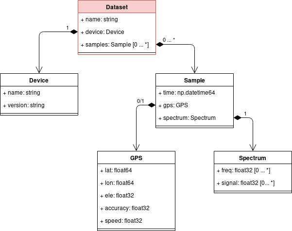

# Data-Backend

Das *Data-Backend* Modul bietet eine Schnittstelle zum Speichern der gesammelten Daten
aus dem PJET2018 Projekt im Dateisystem. Dabei wird die eigentliche Datenspeicherung (das schreiben in eine Datenbank oder in eine Datei -> hier HDF5) abstrahiert.

In der folgenden Abbildung ist die Klassenhierarchie des Data-Backends dargestellt:



(Die tatsächliche Implementierung des Data-backends weicht leicht von der Abbildung ab)

## Getting started
Im Folgenden wird die Einbindung und Verwendung des Data-Backends erläutert.

### 1. Voraussetzungen
Das Dataset-Backend ist auf Python 3 ausgelegt. Es wird davon ausgegangen, dass Python 3 auf
dem Zielsystem installiert und lauffähig ist.
Außerdem muss `pip` (Der standard Paketmanager von Python) installiert sein.

Des Weiteren muss das Python-Modul `virtuelenv` installiert werden:
```
pip install virtualenv
```
(evtl. werden Superuser-Rechte benötigt)


### 2. Virtualenv anlegen (optional, aber empfohlen)
Bei größeren Projekten kann es sinnvoll sein eine virtuelle Python Umgebung (*virtualenv*) zu benutzen.
Der Vorteil solcher Umgebungen ist die Isolation des aktuellen Projekts von anderen
Python Projekten und von der globalen Python-Installation. Z.B. werden die in einer
virtualenv installierten Module ausschließlich in das lokale Projektverzeichnis geladen
und "müllen" so nicht die globale Python installation zu.

Zum Anlegen der virtuellen Umgebung muss der folgende Befehl im Stammverzeichnis des
Projektverzeichnisses ausgeführt werden:
```
virtualenv ./
```

Anschließend (und jedesmal wenn man mit einem neuen Terminal auf die virtuelle Umgebung zugreifen möchte) muss die virtuelle Umgebung aktiviert werden..

Unter Linux:
```
source bin/activate
```

Unter Windows:
```
call Scripts/activate
```


### 3. Data-Backend installieren
Das Data-Backend kann nun über folgenden Befehl installiert werden:
```
pip install git+https://dl0ht.fk4.hs-bremen.de/git/jherkenhoff/Data-Backend.git
```
Es wird nach dem Benutzernamen und dem Passwort für das HS-Git gefragt. Anschließend wird das Data-Backend heruntergeladen und (entweder global oder in der virtualenv) installiert.

### 4. Importieren des Data-Backends
Nach der Installation kann das Data-Backend in eigenen Python-Skripten wie gewohnt importiert werden.
Es besteht aus mehreren Klassen, die zunächst alle importiert werden müssen:
```
from data_backend import Dataset, Sample, GPS, Spectrum
```

### 5. Benutzen der Dataset Klasse


#### Anlegen und speichern
Im Folgenden Beispiel wird verdeutlicht, wie ein Dataset angelegt wird und ein Sample darin gespeichert wird:

```
# Importieren
from data_backend import Dataset, Sample, GPS, Spectrum
import numpy as np

# Erstellen eines neuen Datasets:
dataset = Dataset("/home/PJET2018/datasets/", "neustadt")

# Schreiben der Device-Metadaten
dataset.device.name = "Raspberry Pi"
dataset.device.version = "1.8"

# Ein erstes Sample in das dataset schreiben:
sample1 = Sample(
    time     = np.datetime64( "now" ), 
    spectrum = Spectrum( freq=[1e6, 2e6, 3e6], mag=[-87.9, -82.6, -93.4] ),
    gps      = GPS( lat = 8.8016937, lat = 53.0792962 )
)

# Und schließlich das Sample in das Dataset schreiben:
dataset.samples.append(sample1)

# Zum Schluss (z.B. wenn die Messfahrt durch Bremen beendet wurde)
# sollte das Dataset wieder geschlossen werden:
dataset.close()
```

#### Weitere Samples schreiben
Das folgende Beispiel zeigt, wie weitere Samples in das Dataset geschrieben werden können.
Wie im vorherigem Beispiel können diese einfach mit der `append()` Funktion an ein Dataset angehängt werden: 

```
sample1 = Sample(
    time     = np.datetime64( "now" ), 
    spectrum = Spectrum( freq=[1e6, 2e6, 3e6], mag=[-87.9, -82.6, -93.4] ),
    gps      = GPS( lat = 8.8016937, lat = 53.0792962 )
)
dataset.samples.append(sample1)

sample2 = Sample(
    time     = np.datetime64( "now" ), 
    spectrum = Spectrum( freq=[1e6, 2e6, 3e6], mag=[-90.3, -85.6, -82.3] ),
    gps      = GPS( lat = 8.8016923, lat = 53.0792362 )
)
dataset.samples.append(sample2)
```

**ACHTUNG:** Alle Samples die in einem Dataset gespeichert werden, müssen die selbe Form (z.B: Anzahl Frequenz-Stützstellen) haben.
Das erste Sample, welches einem Dataset mittels `append()` hinzugefügt wurde dient als "Muster" für alle darauffolgenden Samples.
Wurde in einem Dataset z.B. bereits ein Sample mit 2048 Frequenzstützstellen gespeichert, so kann dort kein Sample mehr mit 512 Stützstellen gespeichert werden. In diesem Fall würde Python einen Fehler generieren.

#### Öffnen und auslesen
Im Folgenden Beispiel wird verdeutlicht, wie ein bestehendes Dataset geöffnet wird und daraus gelesen werden kann:

```
# Importieren
from data_backend import Dataset, Sample, GPS, Spectrum
import numpy as np

# Öffnen eines bestehenden Datasets: (Wurde in vorherigem Beispiel angelegt)
# Der Funktionsaufruf unterscheidet nicht zwischen neuem und bestehendem Dataset
dataset = Dataset("/home/PJET2018/datasets/", "neustadt")

# Auslesen des Device Namens
print(dataset.device.name)

# Einen Sample aus dem Dataset lesen:
sample1 = dataset.samples[0]

# Ein paar Beispiele, wie die Daten aus dem Sample ausgelesen werden können:
print(sample1.time)
print(sample.gps.lat)
print(sample.spectrum.freq)

# Auch hier gehört es wieder zum "guten Ton" das Dataset wieder zu schließen
dataset.close()
```


#### Ein Sample ohne GPS-Informationen speichern
Sollen Samples ohne GPS-Informationen gespeichert werden (z.B. für Messungen im E-Gebäude), kann das `gps` Argument beim Erstellen eines Samples einfach weggelassen werden:

```
# Erstellen eines Samples ohne GPS:
sample1 = Sample(
    time     = np.datetime64( "now" ), 
    spectrum = Spectrum( freq=[1e6, 2e6, 3e6], mag=[-87.9, -82.6, -93.4] )
)

# Schreiben ins Dataset:
dataset.samples.append(sample1)
```